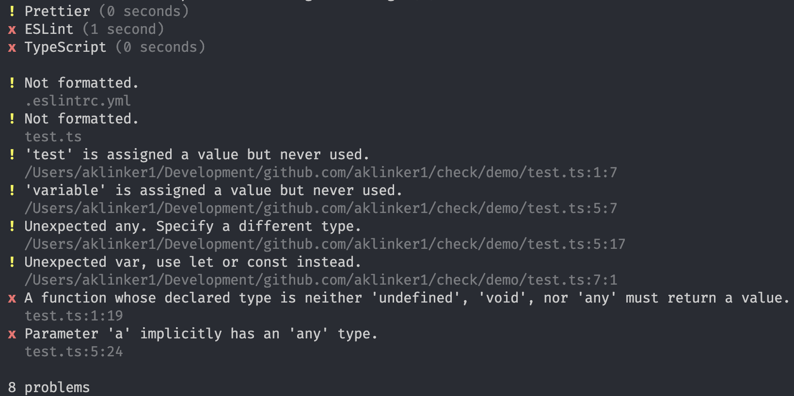

# Check

> [!WARNING]
> I have not actually published this to NPM yet.

```sh
pnpm i @aklinker1/check
pnpm check
pnpm check --fix
```



To enable TS, ESLint, or Prettier, just install the package:

```sh
pnpm i -D typescript eslint prettier
```

## Contributing

Download and install dependencies for Rust CLI and demo TS app.

```sh
cargo build
pushd demo
    pnpm i
popd
```
